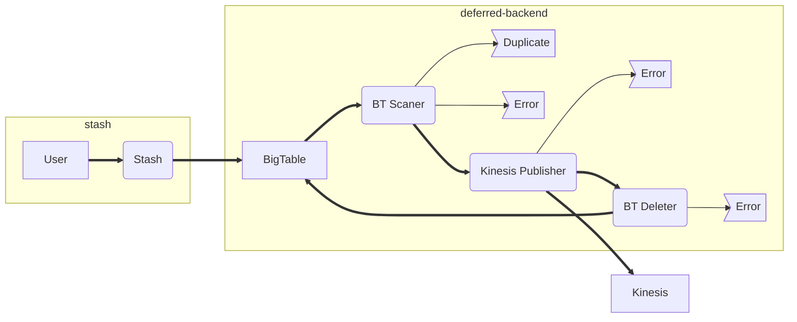

+++
date = "2017-04-01T21:13:56+01:00"
title = "A worked example of monitoring a queue based application"

tags = ["software engineering", "monitoring", "prometheus"]
author = "Laurie Clark-Michalek"
+++

# How to monitor: Queue based applications

The state of the monitoring ecosystem nowadays is pretty amazing. There are tons
of tools that make it easy to add metrics to your systems and alerts to your
metrics. However, that's not enough to actually get much value out of your
monitoring. It just makes it possible to ask 'what should I be monitoring' and
'what should I be alerting'.

This post aims to go through a real service in production at Qubit, and the
metrics and alerts on it. More importantly, it covers the rationale behind the
decisions, and points out the various patterns that occur when implementing
monitoring. Some of those patterns are general to almost any application, while
others are specific to queue based applications. Regardless of if you regularly
write or operate queue based applications, there should be some value somewhere
in this.

## Stash Deferred

At Qubit, we have a service named 'Stash Deferred'. It reads from a database,
[GCP's Cloud Bigtable](https://cloud.google.com/bigtable/), and writes to
[AWS's Kinesis](https://aws.amazon.com/kinesis/streams/). Recently it underwent
a bit of a renovation by the team that I am on, and a colleague commented that
the end result had quite good monitoring, potentially worth of being a case
study. So here's that.

Stash Deferred is a system for deferring message writes. A user sends, via a
HTTP call, a message, and an expiry timestamp. When the expiry time is reached,
the message is put onto the Kinesis queue. There is no guarantee of ordering
given.

Bigtable is a key value store that supports 'get', 'set', 'delete' and 'scan'.
Scan allows you to request values between two keys, in lexicographical
(alphabetical) order. This is the operation that Stash Deferred uses to fetch
messages that should be sent. Every interval we send a request for all of the
values with keys between `deferred:` and `deferred:<current unix timestamp>`.
These are the messages have 'expired', and should be put onto the Kinesis queue.

So, fairly simple. We read rows from Bigtable, publish their contents to
Kinesis, then delete them from Bigtable. This look something like this:


The internal arrows here are unbuffered Go channels. We use them as we perform
the operations at different rates; scans happen in large batches, publishes are
unbatched, and deletes use small batches.

All of the monitoring here is going to be done using
[Prometheus](https://prometheus.io/), with some small bits of
[Grafana](https://grafana.com/). I guess you could replicate most of this with
other monitoring systems, though I'm not sure why you'd want to. Give Prometheus
a go. It's pretty good.

# Basic Monitoring

There are three main operations here that we want to monitor; scan, publish, and
delete. For each of these operations (and basically any operation in any
application) there are two properties we can easily instrument: duration and
count. I'll use the Kinesis publisher as my example for this. We define two
metrics:

```go
var (
  kinesisWriteCount = prometheus.NewCounterVec(
    prometheus.CounterOpts{
      Name: "stashdef_kinesis_message_write_total",
      Help: "count of kinesis messages written, tagged by result",
    },
    []string{"result"},
  )
  kinesisWriteDuration = prometheus.NewHistogram(
    prometheus.HistogramOpts{
      Name:    "stashdef_kinesis_message_write_duration_seconds",
      Help:    "duration of kinesis write operations",
      Buckets: prometheus.ExponentialBuckets(0.1, math.Sqrt(10), 6),
    },
  )
)
```

If you've never seen Prometheus metrics before, then I'll give you a brief
explanation of what I'm declaring here.

The first metric is the variable `kinesisWriteCount`, which is registered as
`stashdef_kinesis_message_write_total` on the Prometheus server. This might seem
like a crazy long name, but there is a certain logic to it. Prometheus metrics
follow the naming convention of `<namespace>_<metric name>_<units>`. In this
case, our namespace is the abbreviated name of our program, `stashdef`. The name
of the metric is always a little contentious, but `kinesis_message_write` is an
understandable description of the operation we're monitoring. The unit is even
less clear, using `total`. There is debate whether `total` or `count` is clearer
to use when you're counting something, but I use `total`, as `count` is often
used by the default Prometheus libraries, and my use is not always compatible
with their use.

The other thing to note about this metric is that we have a label on it.
Prometheus allows you to add labels to your metrics, adding additional
dimensions. In Qubit, we have a convention of having a label on this kind of
counter called result, which has two values: `success` and `failure`.

The second metric is the variable `kinesisWriteDuration`, registered as
`stashdef_kinesis_message_write_duration_seconds`. Much the same as the above,
the key differences are that this is a histogram. A histogram is made up of a
number of counters, each representing a different bucket. Here I set up a set of
exponentially distributed buckets, with 0.1 being my starting bucket, root 10
being my exponent, and 6 being the number of buckets. This results roughly in
buckets counting requests where the durations were between [0,0.1),
[0.1,0.316..), [0.316..,1), etc etc. The use of `math.Sqrt(10)` gives us
2 buckets per order of magnitude, which is useful to cover a large range of
possible durations when you don't know what the 'normal' range for the
operation is.

The other change is in the name of the metric, where we exchange `total` for
`duration_seconds`. Adding the unit to the metric name makes life easier for
everyone involved, and seconds is preferred for durations, given its SI status.
All Prometheus metrics are 64 bit floating point numbers, so the number of cases
where using seconds as a unit could cause issues is negligible.

With our metrics set up, we can now instrument our publishing code.

```go
func (k *KinesisWriter) Write(ctx context.Context, messageChan <-chan Message, delchan chan<- string) error {
  for {
    var msg Message
    select {
    case <-ctx.Done():
      return ctx.Err()
    case msg = <-messageChan:
    }

    started := time.Now()
    err := k.publish(msg)
    if err != nil {
      log.Warningf("could not publish message: %v", err)
      kinesisWriteCount.WithLabelValues("failure").Inc()
    } else {
      kinesisWriteCount.WithLabelValues("success").Inc()
    }
    kinesisWriteDuration.Observe(float64(time.Since(started)) / float64(time.Second))

    select {
    case <-ctx.Done():
      return ctx.Err()
    case delchan <- msg.AckId:
    }
  }
}
```

Gripping stuff. I've omitted some code that handles determining if an error is
retryable and suchlike. With this, we get some incredibly useful metrics. Let's
play with them.

The first thing I'd like to see is the throughput of my system. This is the rate
of increase of the write count metric:

```rule
rate(stashdef_kinesis_message_write_total[1m])
```

The [`rate` function](https://prometheus.io/docs/querying/functions/#rate\(\))
here takes the counter and works out the rate of increase, ignoring any times
that the counter decreases (counters can only decrease when the program restarts
and they are reset to 0). As our metric is not a continuous function, we can't
simply differentiate it, so we need to specify over what period we want our rate
to be calculated. This is the period in the square brackets. 1m is a convention
within Qubit, along with 30m for when you want a calmer, PM friendly, view. The
smaller the window, the less data required, the faster the result, so 1m is
great for quick plots and dashboards.

A general note about rates: it is statistically meaningless to compare two
metrics that have been calculated using rates across different intervals. This
is why it is so important to develop strong conventions around rate intervals.
Imagine a (contrived) situation where your ops team has calculated network
traffic rates at the 5m interval and you have calculated row processing rate at
the 30m interval. Any comparison between the two metrics now becomes a
statistical minefield that would make [Brian Brazil very
unhappy](https://www.youtube.com/watch?v=67Ulrq6DxwA) if he learnt about it.

When we graph this in the Prometheus UI, we get


What we see here is that Prometheus has calculated the rate for each set of
labels we have sent. In the graph's legend, we can see the set of labels that
Prometheus has associated with our metrics. Many of them are generated by
Prometheus based on the metadata attached to our application's deployment, but
on the far right we can see the `result` label. If we had more that one
instance of the application running, we would end up with more than 2 lines. To
merge those lines together, we need to specify an aggregation method. In this
case, as we are interested in the throughput of the system, we probably want to
sum all the lines together, to get the number of messages we are handling per
second:

```rule
sum(rate(stashdef_kinesis_message_write_total[1m]))
```


Note: always sum rates, never rate sums. This is because Prometheus needs all
the help it can get working out when a counter has reset, and rating sums means
that resets will not show the metric going to 0, which is not so good.

Realistically, the information we want on our Grafana dashboard is probably the
overall success and error rates. We can do this by summing over a specific
label. This is similar to the `GROUP BY` statement in SQL:

```rule
sum(rate(stashdef_kinesis_message_write_total[1m])) by (result)
```

Putting that on our dashboard, we get


Beautiful. No errors! Let's take a look at our duration metrics next.

With duration, we have no choice but to show a statistic, as a time series of
a histogram is not particularly possible when we only have two dimensions. An
easy to calculate statistic is the mean time the publish operation takes.

```rule
rate(stashdef_kinesis_message_write_duration_seconds_sum[1m]) /
  rate(stashdef_kinesis_message_write_duration_seconds_count[1m])
```

However the mean is a widely discredited statistic in monitoring circles. Much
preferred is the quantile. Prometheus allows us to calculate quantiles from
histograms using the [`histogram_quantile`
function](https://prometheus.io/docs/querying/functions/#histogram_quantile).

```rule
histogram_quantile(0.99,
  rate(stashdef_kinesis_message_write_duration_seconds_bucket[1m]))
```


Here we can see that our 99%th percentile publish duration is usually 300ms,
jumping up to 700ms occasionally. One great thing about Prometheus is that there
is rarely any confusion over the units, as functions do not as a rule change
units between input and output.

Let's put this quantile, along with 50% and 90%, on our Grafana and admire the
result.


And now repeat for the other two operations. We now have basic instrumentation
that we could apply to pretty much any operation in any program, and get some
form of useful result.

## Slightly interesting monitoring

Is there anything more we need to measure about our program? There are a few
things that this program does that verge on interesting, and we should probably
get some visibility on.

When we read from Bigtable, there is a chance that the row we read is one that
we have read previously, and is currently in the process of being written to
Kinesis or deleted from Bigtable. To combat this, we maintain a list of active
records, and do not send rows to be published if they are in the list of
actives. This gives a rate of duplicates, which we might like to measure.

```go
var (
  bigtableScanDuplicateCount = prometheus.NewCounter(
    prometheus.CounterOpts{
      Name: "stashdef_duplicates_filtered_total",
      Help: "Count of duplicate messages filtered on scan",
    },
  )
)

func (b *BigtableScanner) Scan(ctx context.Context, messageChan chan<- Message) error {
...
  if b.IsActive(msg) {
    bigtableScanDuplicateCount.Inc()
  } else {
    select {
    case <-ctx.Done():
      return ctx.Err()
    case messageChan <- msg:
    }
  }
...
}
```

This metric isn't particularly interesting, but duplication is one of the states
that a row finish in, so having visibility of it is useful. I doubt I'd ever
alert on it, but I might graph it during an incident to see if anything funky
was going on.

### Building a diagram

With that metric, we now have visibility on every exit point of a row from our
application. At Qubit we have a third party plugin installed in our Grafana,
[jdbranham's diagram
plugin](https://grafana.qutics.com/plugins/jdbranham-diagram-panel/edit). It
lets you create diagrams using [Mermaid](https://knsv.github.io/mermaid/)
syntax, and then annotate them and style them based on the value of metrics.
This allows you to produce something like this.


This gives us an overview of how the system works, which is incredibly useful
all on its own, and a quick look at the rates going through each component.

The value here isn't in the quality of the data, as obviously a chart showing us
these values over time would give us a much better dataset with which to judge
things on. The value is the ability for anyone in the company to come to
the Grafana page and see at a glance the components that make up the system.

Dashboards aren't just about showing data. They also need to be interpretable by
people, preferable including the people who didn't create the dashboard. This is
why giving plots titles, units, and even descriptions makes the difference
between some metrics on a page and an actual dashboard. The diagram is just
another tool in that direction.

The diagram plugin takes two main set of inputs. The first is the Mermaid
specification for the diagram, and the second is the mapping from node on the
diagram to metric.

The Mermaid specification for the above graph is provided below. It's pretty
incomprehensible, and the only way you'll get any value out of this section is
by installing the diagram plugin and trying out it out.



Each of the names of the nodes (`A`, `B`, etc) needs a metric to go along with
it. I really recommend using the same units for every metric in the diagram.
I've gone with `sum(rate(<metric>[1m]))`, and I explain that in the title. This
bit is super boring, as you're just matching up labels to metrics.

General notes on the diagram plugin:

1. It'll look ugly. I know. I'm sorry.
2. I wish I could use dot syntax, but the fact that Mermaid is so limiting but
   the plugin is still so useful speaks to the power of diagrams.
3. Use shapes to classify components. I use rectangles for datastores, rounded
   rectangles for processes, and the weird asymmetric shape for resulting states.
4. Avoid squares, circles and rhombuses. Their volume increases at the square of
   the length of any text inside them. This means that a square `Duplicate`
   would be much bigger than a square `Error`, suggesting to the user there are
   more duplicates happening than errors.

### Top users

Nothing we've done so far introspects the data coming through our system. One
common question during an incident relating to volume is 'did someone start
sending something new'? We can add a metric to capture this.

```go
var (
  kinesisDecodeCount = prometheus.NewCounterVec(
    prometheus.CounterOpts{
      Name: "stashdef_kinesis_message_decode_total",
      Help: "count of kinesis messages written, tagged by stream name",
    },
    []string{"stream"},
  )
)
```

This metric has the tag `stream`, which contains the name of the Kinesis stream
we are publishing the messages to.

Now, there are issues with this, the primary being that the values of `stream`
are unbounded. Prometheus scales primarily with the number of metrics, and each
new value of `stream` creates a new metrics. However, in our situation, we are
only creating a single metric per `stream` value, and the value of being able to
see different stream names is greater than the risks involved. When we graph
this, we probably only care about the top few streams. For this, we can use
Prometheus's [`topk`
aggregation](https://prometheus.io/docs/querying/operators/#aggregation-operators).

```rule
topk(4, sum(rate(stashdef_kinesis_message_decode_total[1m]) by (stream))
```


I'm never 100% sure if this is worth it. There have been dashboards where I have
displayed this metric, then removed it, and the re-added it. It's probably worth
having, but looking at it for too long will turn it into a vanity metric.

### Backpressure

When the system reaches saturation, the limiting factor is the Bigtable scanner.
However, it's perfectly possible that the Kinesis publisher could become very
slow, or that the Bigtable deleter could slow down. As the channels between the
components are unbuffered, a slowdown upstream should cause the send on the
channel to slow down, and by measuring this, we can get a sense of it there is a
non scanner slowdown. Implementing this is easy enough.

```go
var (
  bigtableScanBackpressure = prometheus.NewHistogram(prometheus.HistogramOpts{
    Name:    "stashdef_bigtable_row_scan_backpressure_seconds",
    Help:    "Backpressure on the channel out of the row scan",
    Buckets: prometheus.ExponentialBuckets(0.001, math.Sqrt(10), 6),
  })
)

func (b *BigtableScanner) Scan(ctx context.Context, messageChan chan<- Message) error {
...
  sendStarted := time.Now()
  select {
  case <-ctx.Done():
    return ctx.Err()
  case messageChan <- msg:
  }
  bigtableScanBackpressure.Observe(float64(time.Since(sendStarted)) / float64(time.Second))
...
}
```

This metric is almost always incredibly low, as a channel send is very fast when
there is a listener on the other end. However, as soon as there is a delay
upstream, this metric becomes very important.

Plotting this in Grafana, I take the same approach as our other duration based
metrics, using quantiles at 50%, 90%, and 99%.


The use of a log scale here makes it easier to handle the massive difference
between an unhindered send, which is under 1ms, and a hindered send, which can
be in the 100s of milliseconds.

## Pagable metrics

I wouldn't page on any of the metrics we've collected so far. The key property
for an alert being pagable is user impact, and everything we've talked is very
much a cause, not a symptom. To work out what we want to page on, we need to
think about what happens when our system fails, and what do our users
experience. In this case, there are two main symptoms; message lag and message
drops.

To measure these, we have a completely separate application. This application (I
call it `lag-monitor`) periodically sends messages with very short expiry, and
then listens to the destination queue to see how long it takes before a message
comes through. This exposes two main metrics

```go
const (
  stashDeferredLag = prometheus.NewGauge(prometheus.GaugeOpts{
    Name: "stashdef_lag_seconds",
    Help: "The last Stash deferred lag",
  })
  stashDeferredLastReceived = prometheus.NewGauge(prometheus.GaugeOpts{
    Name: "stashdef_last_received_timestamp_seconds",
    Help: "The timestamp when we last received a message from Stash deferred",
  })
)
```

I'm going to omit the code that writes to these metrics, as it's fairly involved
in talking to the frontend of the service, though it looks a little like.

```
func sender(...) {
  for time.Tick(interval) {
    sendMessage(time.Now())
  }
}
func receiver(...) {
  for msg := range receiveMessages() {
    lag := time.Since(msg.SentAt)
    stashDeferredLag.Set(float64(lag) / float64(time.Second))
    stashDeferredLastReceived.Set(time.Now().UnixNano() / 1e9)
  }
}
```

Notably, this monitors more than just the Stash Deferred service, it also
monitors the service that inserts messages into the BigTable database. You could
question whether this really constitutes monitoring for this service, but if the
frontend goes down, then my service's users are affected, so I want to know when
that happens.

The current lag can then be calculated as the time since we got a message, plus
the lag on that message. This looks like

```rule
(time() - max(stashdef_last_received_timestamp_seconds)) + max(stashdef_lag_seconds)
```

We don’t just track the `stashdef_lag_seconds` as if the lag monitor were to
fail, that metric would stop updating. The safest measure of lag is the lag
measured by the lag monitor plus the time since we last measured that lag, as if
the lag monitor fails, the result of `time()` will continue increasing
regardless.


The spiky nature of this graph comes from our use of Prometheus's
[`time` function](https://prometheus.io/docs/querying/functions/#time\(\)),
which steadily increases, while the last received metric resets every time we get
a message.

This is the metric I want to alert on. Let's write a Prometheus alert on this

```rule
job:stashdef_lag:seconds =
  (time() - max(stashdef_last_received_timestamp_seconds)) + max(stashdef_lag_seconds)

ALERT StashDeferredLagHigh
  IF job:stashdef_lag:seconds > 5 * 60
  FOR 2m
  LABELS {
    slack_channel="stash-deferred"
  }
  ANNOTATIONS {
    description="Stash deferred messages are arriving {{ $value }} seconds after they were scheduled (threshold 5m)"
  }
```

Here we set up a [recording rule](https://prometheus.io/docs/querying/rules/) to
continuously calculate and store our lag, along with an alert on that lag
calculation.  The alert syntax is a wee bit odd, but should read: the alert
`StashDeferredLagHigh` will fire if the metric `job:stashdef_lag:seconds` is
greater than 300 for 2 minutes. When it fires, it should send to the slack
channel `stash-deferred`, with the following description [description omitted].

The durations specified in the alert above are a bit arbitrary, and will be
subject to tweaks over time. With the current setup, we can say that should the
process stop processing messages altogether, it will take 4 minutes before the
metric is above 300 seconds (i.e. 5 minutes of lag), and then another 2 minutes
before the alert will fire. This is perfectly acceptable for this system. Your
system may have very different users who rely on a different guarentees.

The Slack integration is set up in our
[alertmanager](https://github.com/prometheus/alertmanager) config. I'd really
recommend integrating with whatever chat system your organisation uses.
Recording rules are also a great idea, and in general if you want
a dashboard to load quickly, I'd recommend implementing the queries you are
plotting as recording rules. All of the screenshots of Grafana plots in this
post are actually of recording rules, not the 'raw' queries.

# Putting it together

Our final dashboard looks like...


The additions made here are:

1. The Bigtable deletion rate graph. Failed Bigtable deletions can result in
   duplicate messages, so we prioritise this metric.
2. Component memory usage. This is a metric fetched from the Kubernetes cluster,
   and is mostly there so I can say 'look how efficient it is!'

In the future, as I gain more experience operating this service, I plan to
demote some of the duration metrics to below the fold on this dashboard, as they
seem to be subject to seemingly alarming changes under completely normal
operation. I also hope to spend some time addressing dropped messages in a more
holistic manner in the lag monitor component.
